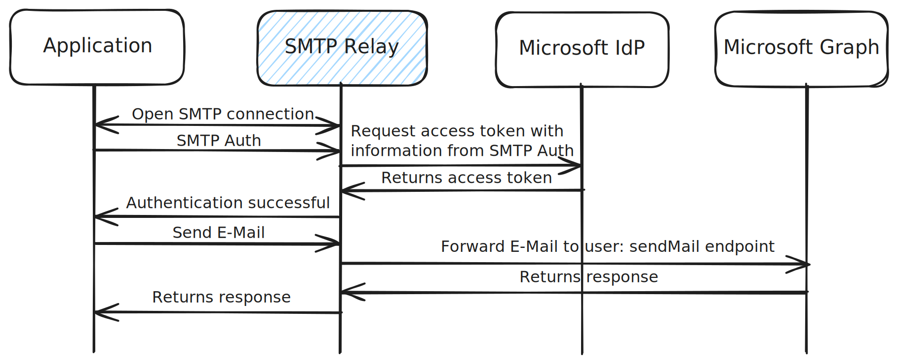

# SMTP OAuth Relay
An SMTP server that acts as a relay between traditional SMTP clients and the Microsoft Graph API, using OAuth 2.0 authentication to send emails.

## Overview
This project implements an SMTP server that authenticates using application credentials against the Microsoft IdP and sends emails through Microsoft Graph. It enables applications that only support SMTP to send emails through Microsoft services using modern OAuth authentication methods.

## Getting started
### Using Docker (recommended)
The easiest way to run the SMTP OAuth Relay is via Docker:
```shell
docker run --name smtp-relay -p 8025:8025 \
  -v $(pwd)/certs:/usr/src/smtp-relay/certs \
  -e LOG_LEVEL=INFO \
  -e USE_TLS=True \
  -e REQUIRE_TLS=True \
  ghcr.io/justiniven/smtp-oauth-relay:latest
```


## Configuration
The server can be configured using the following environment variables:
| Variable        | Description                                           | Default                          |
|-----------------|-------------------------------------------------------|----------------------------------|
| LOG_LEVEL       | Logging level (DEBUG, INFO, WARNING, ERROR, CRITICAL) | INFO                             |
| USE_TLS         | Enable/disable TLS                                    | True                             |
| REQUIRE_TLS     | Require TLS for authentication                        | True                             |
| SERVER_GREETING | SMTP server greeting message                          | Microsoft Graph SMTP OAuth Relay |

### Certificate Management
The SMTP OAuth Relay requires TLS certificates when operating with `USE_TLS=True` (the default). Certificates are expected in the `/usr/src/smtp-relay/certs` directory with these filenames:
- `cert.pem` - The TLS certificate file
- `key.pem` - The private key file


## Usage
### Setup in Microsoft Entra ID
1. Create an application in Microsoft Entra ID with the application permission `Send.Mail`
2. Grant admin consent for the permission
3. Create an application secret
4. Note your tenant ID, application (client) ID, and client secret
<details>
<summary>Create and restrict Application with PowerShell</summary>

```powershell
$appName = "SMTP Relay"
$appSecretEndDateTime = (Get-Date).AddYears(2)
$senderAddress = "test@example.com"


Connect-MgGraph -Scopes "Application.ReadWrite.All" -NoWelcome
Connect-ExchangeOnline -ShowBanner:$false


# create application
$application = Invoke-MgGraphRequest `
    -Method "POST" `
    -Uri "https://graph.microsoft.com/v1.0/applications" `
    -Body @{
        displayName = $AppName
        signInAudience = "AzureADMyOrg"
        passwordCredentials = @(
            @{
                displayName = "secret01"
                endDateTime = $appSecretEndDateTime
            }
        )
        requiredResourceAccess = @(
            @{
                resourceAppId = "00000003-0000-0000-c000-000000000000" # Microsoft Graph
                resourceAccess = @(
                    @{ 
                        id = "b633e1c5-b582-4048-a93e-9f11b44c7e96" # Send.Mail
                        type = "Role"
                    }
                )
            }
        )
    }


# create service principal
$servicePrincipal = Invoke-MgGraphRequest `
    -Method "POST" `
    -Uri "https://graph.microsoft.com/v1.0/servicePrincipals" `
    -Body @{
        appId = $application.appId
        tags = @(
            "WindowsAzureActiveDirectoryIntegratedApp"
            "HideApp"
        )
    }


# grant tenant-wide admin consent
Invoke-MgGraphRequest `
    -Method "POST" `
    -Uri "https://graph.microsoft.com/v1.0/servicePrincipals/$($servicePrincipal.id)/appRoleAssignments" `
    -Body @{
        principalId = $servicePrincipal.id
        resourceId = "7aeb2b66-3434-4d91-b79e-fe5f94c2634b" # Microsoft Graph Service Principal
        appRoleId = "b633e1c5-b582-4048-a93e-9f11b44c7e96" # Send.Mail
    }


# restrict the application to send emails only from the specified sender addresses
New-ApplicationAccessPolicy `
    -AppId $application.appId `
    -PolicyScopeGroupId $senderAddress `
    -AccessRight RestrictAccess `
    -Description "Restrict the SMTP Relay application to send emails only from the specified sender addresses"


# get tenant id
$tenantId = (Get-MgContext).TenantId


Write-Host "Username: " -NoNewline
Write-Host "$($tenantId):$($application.appId)" -ForegroundColor Green
Write-Host "Password: " -NoNewline
Write-Host "$($application.passwordCredentials[0].secretText)" -ForegroundColor Green
```

</details>

### SMTP Client Configuration
Configure your SMTP client with the following settings:
| Setting   | Value                      |
|-----------|----------------------------|
| Server    | Your SMTP OAuth Relay host |
| Port      | `8025`                     |
| SMTP-Auth | `STARTTLS` or no auth      |
| Username  | `tenant_id:client_id`      |
| Password  | `client_secret`            |


## How it works
1. The SMTP server accepts connections on port 8025
2. Clients authenticate using tenant_id:client_id as username and client_secret as password
3. The server obtains an OAuth token from the Microsoft identity platform
4. When an email is received via SMTP, it's converted to a Microsoft Graph API request
5. The email is sent using the application's permissions



## Security Considerations
- Always use TLS in production environments
- Store client secrets securely
- Restrict application permissions to only the necessary sender addresses

## FAQ
Q: Can I use this relay with any SMTP client? \
A: Yes, any SMTP client that supports AUTH PLAIN or AUTH LOGIN should work.

Q: Does this support multiple sender addresses? \
A: Yes, you can configure your Entra ID application to have permissions for multiple sender addresses.

Q: Can the relay be used with email addresses from different Microsoft tenants? \
A: Yes, since the service relies on the tenant ID in the username, it can be used with multiple tenants simultaneously.

Q: Is this relay suitable for high-volume email sending? \
A: This relay is designed for moderate email volumes. Exchange Online rate limits apply. For high-volume scenarios, consider Microsoft's native services like Azure Communication Services or Microsoft 365 High Volume Email.

Q: Can I run multiple instances for high availability? \
A: Yes, the relay is stateless and can be run in multiple instances behind a load balancer.


## License
This project is licensed under the Apache License 2.0 - see the [LICENSE](./LICENSE) file for details.
