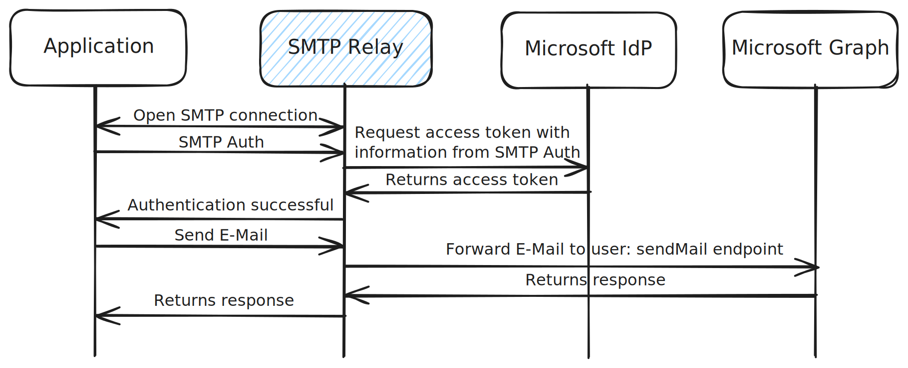

# SMTP OAuth Relay

An SMTP relay that accepts SMTP submissions from legacy clients and forwards messages to Microsoft Graph using OAuth 2.0 client credentials.

## Overview

This repository implements a small, stateless SMTP server that bridges the gap between legacy SMTP clients and Microsoft 365's modern authentication requirements:

- 🔒 **OAuth 2.0 Authentication**: Uses application credentials instead of user passwords
- 📧 **Microsoft Graph Integration**: Sends email via the Microsoft Graph API
- 🔌 **SMTP Compatibility**: Works with any SMTP client (AUTH LOGIN/PLAIN)
- 🚀 **Stateless & Scalable**: Can be deployed in multiple instances for high availability
- 🔐 **Security-First**: Supports TLS encryption and Azure Key Vault integration
- 📊 **Azure Tables Support**: Optional centralized credential management

### Comparison with Other Solutions

| Feature | SMTP OAuth Relay | Azure Communication Services | Microsoft 365 High Volume Email (Preview) |
|---------|-----------------|------------------------------|----------------------------------|
| **Purpose** | Bridge legacy SMTP clients to Microsoft 365 | General email/SMS/voice service | High-volume transactional email |
| **Use Case** | Legacy devices, printers, apps without OAuth | Application email/SMS at scale | Marketing, newsletters, bulk email |
| **SMTP Support** | ✅ SMTP compatibility | ✅ SMTP available | ✅ SMTP compatibility |
| **Send Externally** | ✅ Yes (to any recipient) | ✅ Yes (to any recipient) | ❌ No (only internal) |
| **Legacy Device Support** | ✅ Excellent | ⚠️ Moderate* | ✅ Excellent |
| **Multi-tenant** | ✅ Yes | ❌ No | ❌ No |
| **Sender Address** | Uses existing M365 mailboxes | Custom domains | Uses dedicated Mailbox (HVE-Account) |
| **Pricing** | Free (self-hosted) | Pay-per-use (email/SMS/calls) | Free in Preview |
| **Infrastructure** | Self-hosted (Docker/K8s) | Fully managed Azure service | Fully managed Microsoft service |
| **Deliverability** | Microsoft 365 reputation | Separate IP pools and reputation | Microsoft 365 reputation |
| **Volume Limits** | Based on M365 mailbox limits | Very high (purpose-built for scale) | Very high (designed for bulk) |
| **Setup Complexity** | Moderate (deploy + Entra app) | Moderate (provision resource + Entra app) | Low (create HVE-Account) |

*Some legacy devices may not support providing a dedicated From address or may implement a character limit, which won't work with ACS.

## Quick Start

### Deploy on Azure
[](https://portal.azure.com/#create/Microsoft.Template/uri/https%3A%2F%2Fraw.githubusercontent.com%2FJustinIven%2Fsmtp-oauth-relay%2Fmain%2Fazure_deployment%2Fdeployment.json)

Refer to the [Installation Guide](docs/installation.md) for detailed steps.


### Run with Docker

```bash
docker run --name smtp-relay -p 8025:8025 \
  -v $(pwd)/certs:/usr/src/smtp-relay/certs \
  -e LOG_LEVEL=INFO \
  -e TLS_SOURCE=file \
  -e REQUIRE_TLS=true \
  ghcr.io/justiniven/smtp-oauth-relay:latest
```

### Basic Configuration

| Setting | Value |
|---------|-------|
| **SMTP Server** | Your relay hostname |
| **Port** | 8025 |
| **Security** | STARTTLS |
| **Username** | `tenant_id@client_id` |
| **Password** | Your app's client secret |

## Documentation

### 📘 Getting Started
- **[Installation Guide](docs/installation.md)** - Docker, Kubernetes, manual installation
- **[Configuration Reference](docs/configuration.md)** - All environment variables explained
- **[Azure/Entra ID Setup](docs/azure-setup.md)** - Create and configure Azure applications

### 🔧 Configuration
- **[Client Setup Guide](docs/client-setup.md)** - Configure email clients, printers, applications
- **[Authentication Guide](docs/authentication.md)** - Username formats, UUID encoding, lookup tables
- **[Azure Tables Integration](docs/azure-tables.md)** - Centralized credential management

### 🏗️ Architecture & Help
- **[Architecture & How It Works](docs/architecture.md)** - Technical implementation details
- **[FAQ](docs/faq.md)** - Frequently asked questions

## Features

### Authentication Options

**Direct UUID Format**:
```
12345678-1234-1234-1234-123456789abc@abcdefab-1234-5678-abcd-abcdefabcdef
```

**Base64URL Encoded** (shorter):
```
EjRWeBI0EjQSNBI0VnirzQ@q83rrBI0VnirzN21q837qg
```

**Azure Tables Lookup** (custom):
```
printer1@lookup
```

### TLS Certificate Sources

- **File**: Load from filesystem (development, production with Let's Encrypt)
- **Azure Key Vault**: Managed certificate storage with automatic rotation
- **Off**: Disable TLS (development only)

### Advanced Features

- ✅ Multiple tenant support (single relay for multiple organizations)
- ✅ Application Access Policies integration (restrict sender addresses)
- ✅ Azure Tables for simplified credentials
- ✅ Sender address override
- ✅ Horizontal scaling (stateless design)
- ✅ Comprehensive logging and monitoring

## Architecture



## Use Cases

### Legacy Devices
- Network printers with scan-to-email
- Multifunction devices
- Fax servers
- Security cameras

### Applications
- Monitoring systems (Grafana, Nagios)
- CI/CD pipelines (Jenkins, GitLab)
- Content management systems (WordPress, Drupal)
- Custom applications without OAuth support

### Network Infrastructure
- NAS devices (Synology, QNAP)
- Firewalls and routers
- UPS systems
- IoT devices

## Requirements

### Server Requirements
- Python 3.11+ (if running manually)
- Docker (recommended) or Kubernetes
- Network access to Microsoft APIs
- TLS certificate (production)

### Azure Requirements
- Microsoft 365 / Exchange Online tenant
- Microsoft Entra ID (Azure AD)
- Application registration with Mail.Send permission

### Optional
- Azure Key Vault (for certificate management)
- Azure Table Storage (for credential lookup)
- Managed Identity (for Azure services)

## Security

This relay implements security best practices:

- 🔐 **TLS Encryption**: Protects credentials in transit
- 🔑 **OAuth 2.0**: No user passwords stored or transmitted
- 🛡️ **Application Permissions**: Centrally managed in Azure
- 📝 **Audit Logging**: Full activity logs in Azure AD
- 🚫 **Access Policies**: Restrict sender addresses
- 🔄 **Secret Rotation**: Regular credential rotation support

## Known Limitations

-- Due to a limitation in the Microsoft Graph `user: sendMail` endpoint, emails cannot be sent from alias addresses and will always be sent from the primary mailbox. (Issue [#80](https://github.com/JustinIven/smtp-oauth-relay/issues/80))

## Community & Support

- 📖 **Documentation**: Comprehensive guides in the `docs/` folder
- 🐛 **Bug Reports**: [GitHub Issues](https://github.com/justiniven/smtp-oauth-relay/issues)
- 💡 **Feature Requests**: [GitHub Issues](https://github.com/justiniven/smtp-oauth-relay/issues)
- 🤝 **Contributions**: Pull requests welcome!

## License

This project is licensed under the Apache License 2.0 - see the [LICENSE](./LICENSE) file for details.

## Acknowledgments

Built with:
- [aiosmtpd](https://aiosmtpd.aio-libs.org/) - SMTP server framework
- [Microsoft Graph API](https://learn.microsoft.com/en-us/graph/) - Email sending
- [Microsoft Identity Platform](https://learn.microsoft.com/en-us/entra/identity-platform/) - OAuth authentication

---

**Ready to get started?** → [Installation Guide](docs/installation.md)
