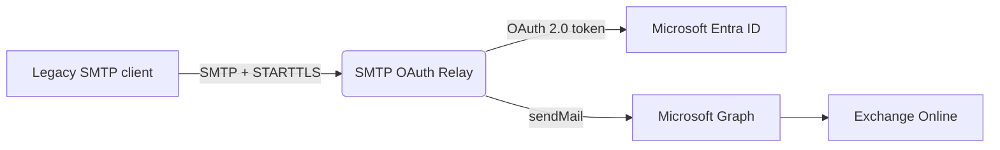

# SMTP OAuth Relay

A small, stateless SMTP server that lets legacy clients (printers, NAS, monitoring tools, line-of-business apps) send mail through **Microsoft 365** using **OAuth 2.0 client credentials** and the **Microsoft Graph API** — no Basic Authentication required.



- :material-key: **OAuth 2.0 client credentials** — app credentials instead of user passwords
- :material-microsoft: **Microsoft Graph** — sends via the `sendMail` endpoint
- :material-power-plug: **SMTP compatible** — any client supporting `AUTH LOGIN`/`PLAIN` + STARTTLS
- :material-server: **Stateless** — scale horizontally behind a load balancer
- :material-lock: **TLS** from file or Azure Key Vault
- :material-table: **Azure Tables** — optional central credential lookup

---

## Quick start

Three steps to a working relay. You need a Microsoft 365 tenant and permission to register an Entra ID application.

### 1. Create Entra ID credentials (PowerShell)

The [`New-RelayEntraApp.ps1`](entra-id-setup/index.md) script registers the app, creates a secret, and restricts it to a single sender mailbox.

```powershell
# Prerequisites: PowerShell 5.1+, Microsoft.Graph and ExchangeOnlineManagement modules
Connect-MgGraph -Scopes "Application.ReadWrite.All", "AppRoleAssignment.ReadWrite.All" -NoWelcome
Connect-ExchangeOnline -ShowBanner:$false

Invoke-WebRequest `
  -Uri "https://raw.githubusercontent.com/JustinIven/smtp-oauth-relay/main/New-RelayEntraApp.ps1" `
  -OutFile "New-RelayEntraApp.ps1"

.\New-RelayEntraApp.ps1 -DisplayName "SMTP OAuth Relay" -SenderAddress "noreply@example.com"
```

The script prints the **SMTP username** (`tenant_id@client_id`) and **SMTP password** (client secret). Save them — the secret cannot be retrieved later.

### 2. Run the relay

=== "Docker"

    ```bash
    docker run --name smtp-relay -p 8025:8025 \
      -e TLS_SOURCE=off \
      -e REQUIRE_TLS=false \
      ghcr.io/justiniven/smtp-oauth-relay:latest
    ```

    !!! warning "TLS is recommended"
        Only disable TLS for testing in a trusted network. Use `TLS_SOURCE=file` or `TLS_SOURCE=keyvault` in production.

=== "Azure (one-click)"

    [](https://portal.azure.com/#create/Microsoft.Template/uri/https%3A%2F%2Fraw.githubusercontent.com%2FJustinIven%2Fsmtp-oauth-relay%2Fmain%2Fazure_deployment%2Fdeployment.json)

    Deploys an Azure Container Instance with a managed identity. See the [Azure install guide](installation/azure.md).

### 3. Point your client at the relay

| Setting | Value |
|---------|-------|
| Server | Your relay hostname |
| Port | `8025` |
| Security | STARTTLS |
| Username | `tenant_id@client_id` (from step 1) |
| Password | Client secret (from step 1) |

!!! tip "Verify it works"

    === "PowerShell"

        ```powershell
        $cred = Get-Credential   # User: tenant_id@client_id  Password: client_secret
        Send-MailMessage -SmtpServer relay.example.com -Port 8025 -UseSsl `
          -Credential $cred `
          -From noreply@example.com -To you@example.com `
          -Subject 'Relay test' -Body 'Relay test'
        ```

    === "swaks"

        ```bash
        swaks --server relay.example.com:8025 --tls \
          --auth-user 'tenant_id@client_id' --auth-password 'client_secret' \
          --from noreply@example.com --to you@example.com --body 'Relay test'
        ```

---

## Next steps

<div class="grid cards" markdown>

- :material-download: **[Install](installation/index.md)** — Docker, Azure, Kubernetes, or manual
- :material-microsoft-azure: **[Entra ID setup](entra-id-setup/index.md)** — app registration and sender restrictions
- :material-cog: **[Configuration](configuration.md)** — environment variable reference
- :material-devices: **[Client setup](client-setup.md)** — printers, NAS, firewalls, apps
- :material-key-variant: **[Authentication](authentication.md)** — username formats and encoding
- :material-help-circle: **[FAQ](faq.md)** — common questions

</div>

## When to use this relay

| | SMTP OAuth Relay | Azure Communication Services | M365 High Volume Email |
|---|---|---|---|
| Purpose | Bridge legacy SMTP to M365 | App email/SMS at scale | Bulk/transactional |
| Send externally | :material-check: | :material-check: | :material-close: internal only |
| Sender address | Existing M365 mailboxes | Custom domains | Dedicated HVE account |
| Multi-tenant | :material-check: | :material-close: | :material-close: |
| Pricing | Free (self-hosted) | Pay-per-use | Free (preview) |
| Hosting | Self-hosted | Managed | Managed |
